# Multi-Cloud IAM and Non-Human Identity Governance — Walkthrough

This document walks through the full build of this project, phase by
phase, with screenshots showing the real process, including the
troubleshooting moments and fixes along the way.

---

## Phase 1: Lab Setup

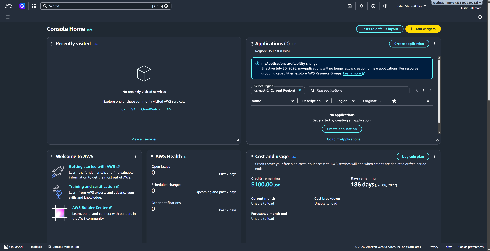

The lab began with a new AWS account on the Free Plan, which includes
up to $200 in credits over six months. IAM and CloudFormation are free
regardless of plan, so this tier was more than sufficient for this
project. The account was created using a primary Gmail address rather
than an alias, since the security risk was low for a personal lab
environment.

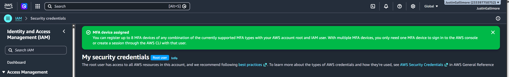

Multi-factor authentication was enabled on the AWS root account using
Microsoft Authenticator. The device name field does not accept spaces,
so it was set to `root-mfa-homelab`.

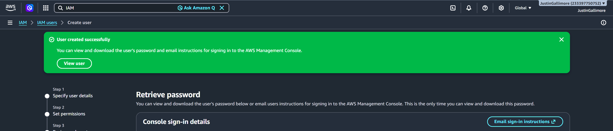

Rather than using the root account for day to day work, a dedicated
IAM user, `jgallimore-admin`, was created with console access and
added to a new `iam-admins` group with the AdministratorAccess policy
attached.

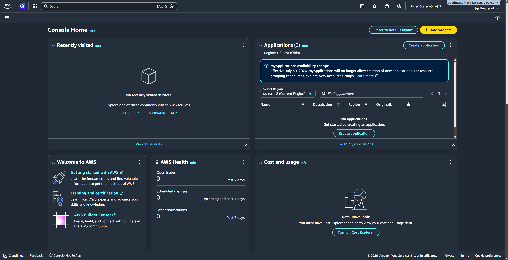

All further work in this lab was done as `jgallimore-admin`. The root
account was retired from active use going forward, in line with AWS
best practice.

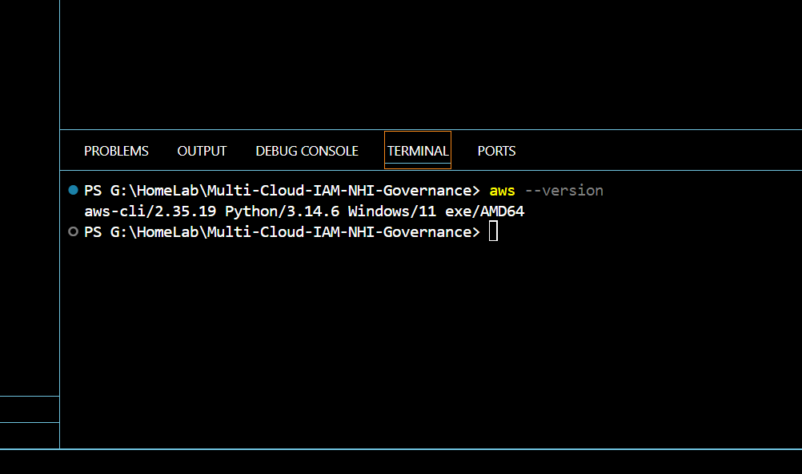

AWS CLI v2 was installed. This required a full restart of VS Code for
the updated PATH environment variable to be recognized by the
terminal, a pattern that repeated with other tools installed later in
this project.

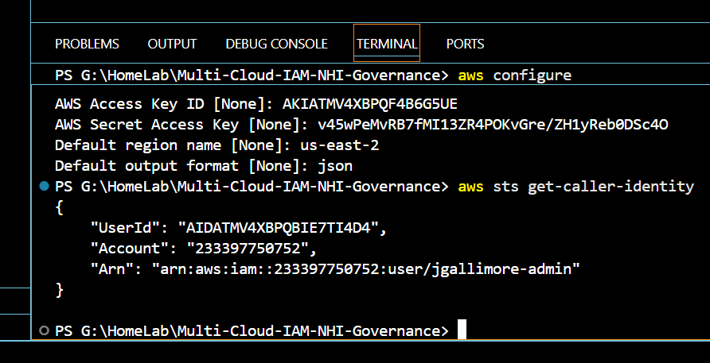

`aws configure` was run using an access key generated specifically for
CLI use by `jgallimore-admin`. The configuration was verified with
`aws sts get-caller-identity`, which became the standard safe
verification command used throughout this project instead of
screenshotting the configuration step itself.

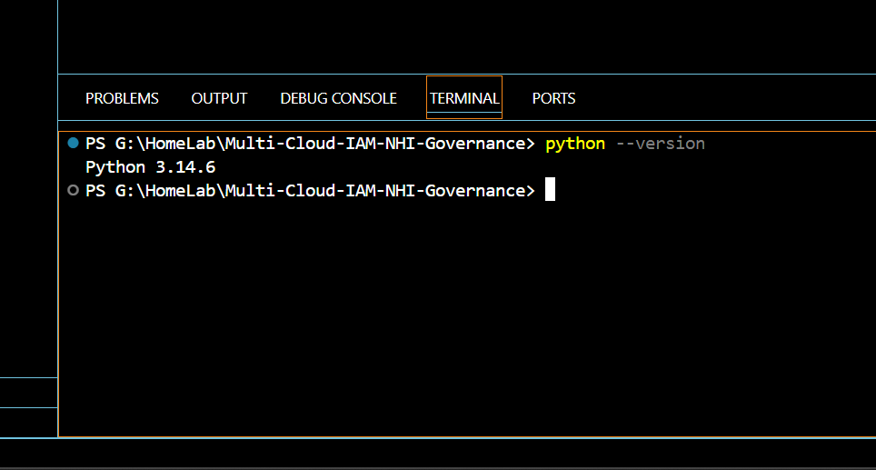

Python 3.14.6 was installed using the standalone installer rather than
the newer Python Install Manager, since the standalone installer
retains the classic "Add python.exe to PATH" checkbox. A virtual
environment was created for this project to keep dependencies
isolated.

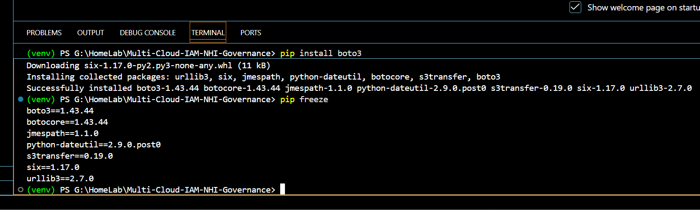

With the virtual environment activated, `boto3` was installed via pip,
completing the toolchain needed to begin scripting against AWS.

---

## Phase 2: AWS and Azure Audit Scripts

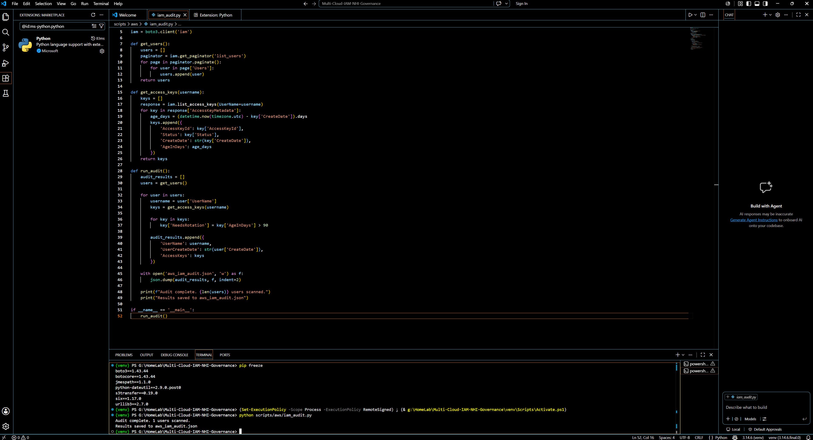

`scripts/aws/iam_audit.py` was built to pull every IAM user and role in
the account, along with each user's access keys, flagging any key
older than 90 days as needing rotation. The first run scanned one user,
`jgallimore-admin`, and three default AWS service-linked roles.

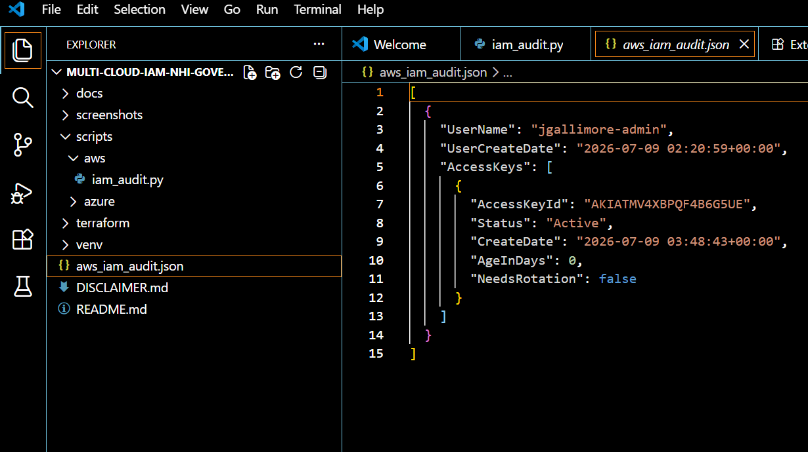

The script's output, `aws_iam_audit.json`, was reviewed to confirm the
structure was correct, with separate `Users` and `Roles` arrays.

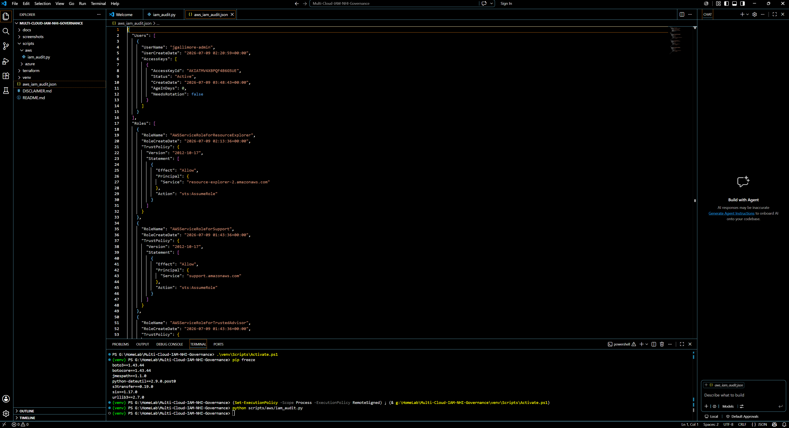

A closer review confirmed the trust policies for each AWS service-
linked role were captured correctly, which later fed directly into the
ownership mapping logic in Phase 3.

With the AWS side of the audit complete, focus shifted to Azure. The
Azure CLI was installed to support authentication and scripting
against the Azure tenant.

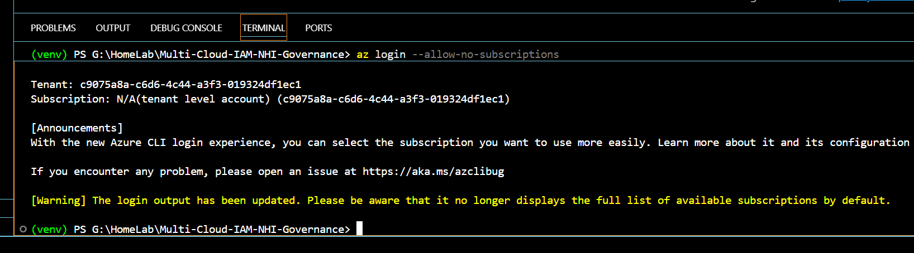

Login was performed using `az login --allow-no-subscriptions`, since
this tenant is Entra ID only with no billing subscription attached.
Authentication used a native internal admin account,
`labadmin@justingallimoregmail.onmicrosoft.com`, created specifically
to avoid the P2 trial activation issues that occur when a tenant is
anchored to a personal Microsoft account.

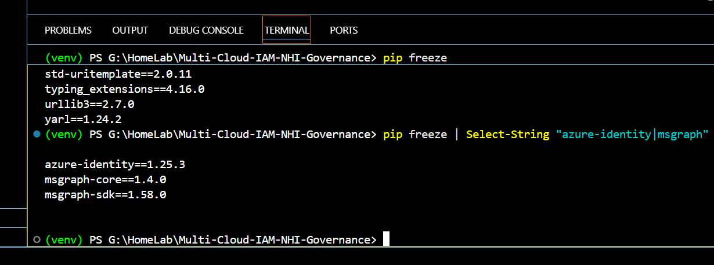

The `azure-identity` and `msgraph-sdk` Python packages were installed
to support scripting against Microsoft Graph.

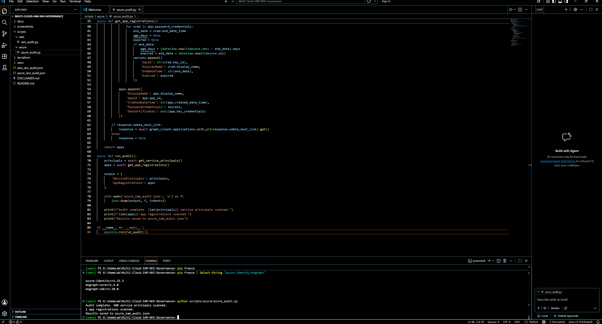

`scripts/azure/azure_audit.py` was built using `DefaultAzureCredential`
and an async `GraphServiceClient` to pull all service principals and
app registrations in the tenant. The first run scanned 108 service
principals, mostly Microsoft first-party system objects, and one app
registration belonging to this project.

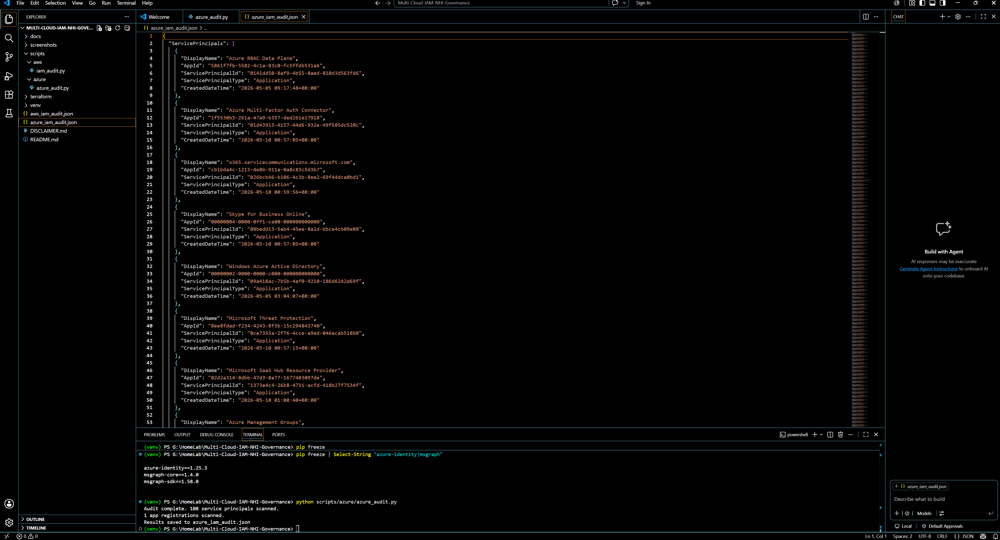

The Azure audit output was verified, confirming password credential
expiration checks and certificate flags were captured correctly for
the app registration.

---

## Phase 3: Ownership Mapping

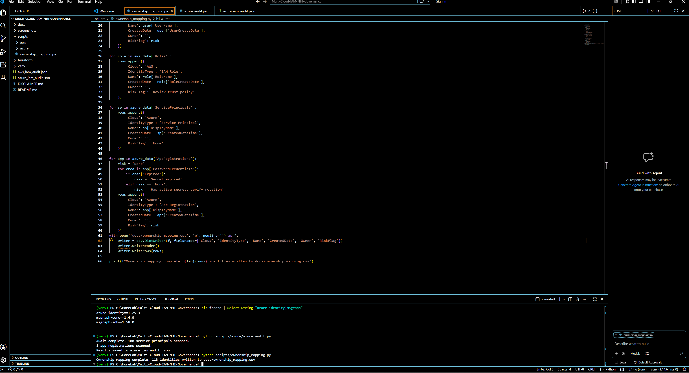

`scripts/ownership_mapping.py` was built to read both the AWS and
Azure audit JSON files and produce a single unified view of every
identity across both clouds, with fields for Cloud, IdentityType,
Name, CreatedDate, Owner, and RiskFlag.

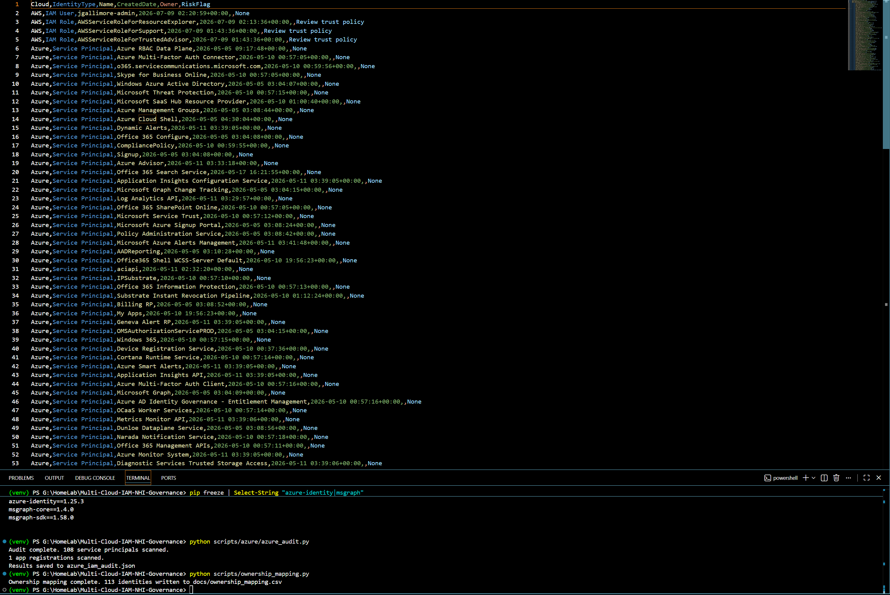

The script's output, `docs/ownership_mapping.csv`, combined 113 total
identities from both clouds into one reviewable file.

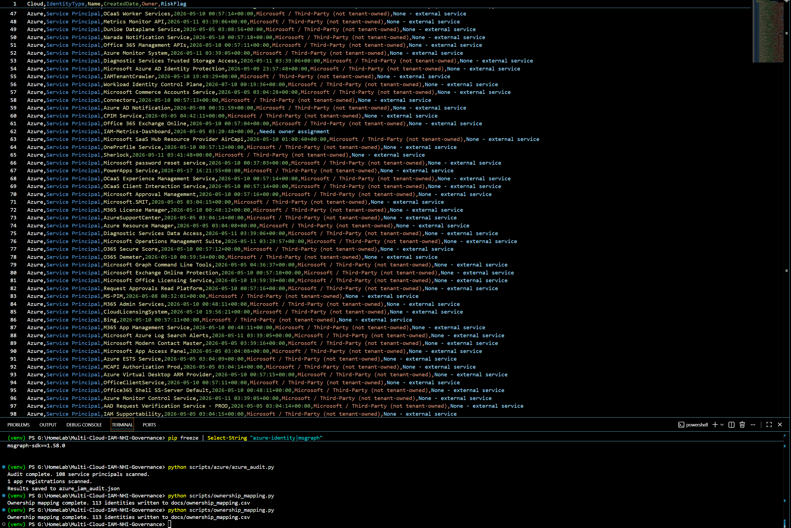

An automation improvement was added to cross-reference Azure service
principal AppIds against owned app registration AppIds. Matched,
tenant-owned identities were flagged for manual owner assignment,
while unmatched Microsoft or third-party service principals were
automatically labeled and marked as no risk.

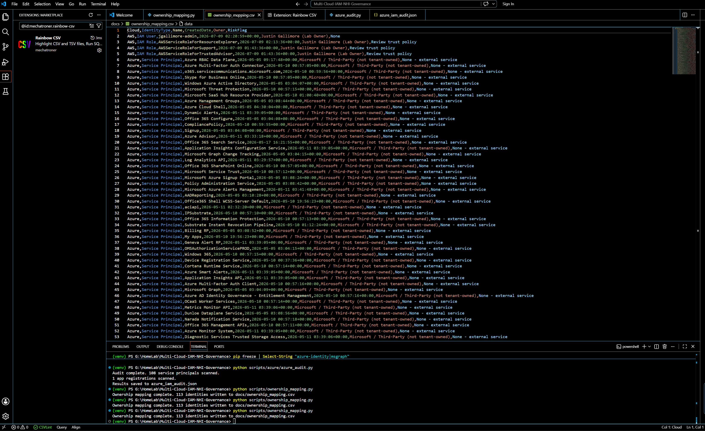

A final automation pass filled any remaining blank Owner fields with
"Justin Gallimore (Lab Owner)", since this is a single-admin lab. The
result was 113 identities with zero blank owner fields, ready to feed
into the rotation policy and later the attestation workflow.

---

## Phase 4: Rotation Policy

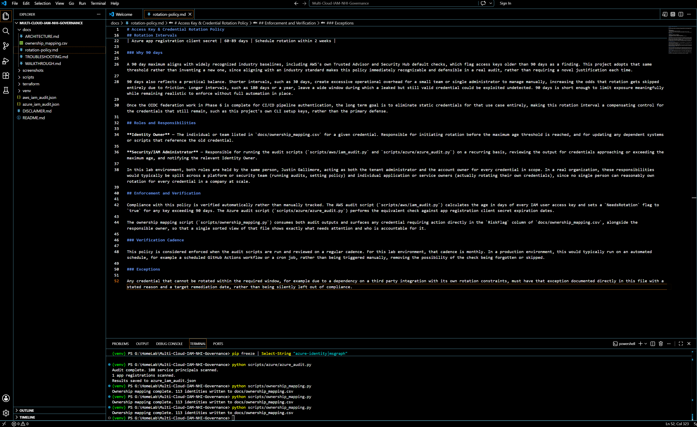

`docs/rotation-policy.md` was written to formalize how static
credentials in this environment should be rotated. It defines a 90 day
maximum age for AWS access keys and Azure client secrets, with a two
week grace window once a credential reaches 60 to 89 days old. The
document explains the reasoning behind the 90 day figure, ties
directly into the `NeedsRotation` flag already being generated by the
audit scripts, and notes that Phase 6's OIDC federation work would
eventually eliminate the CI/CD static credential use case entirely.

---

## Phase 5: Attestation Workflow

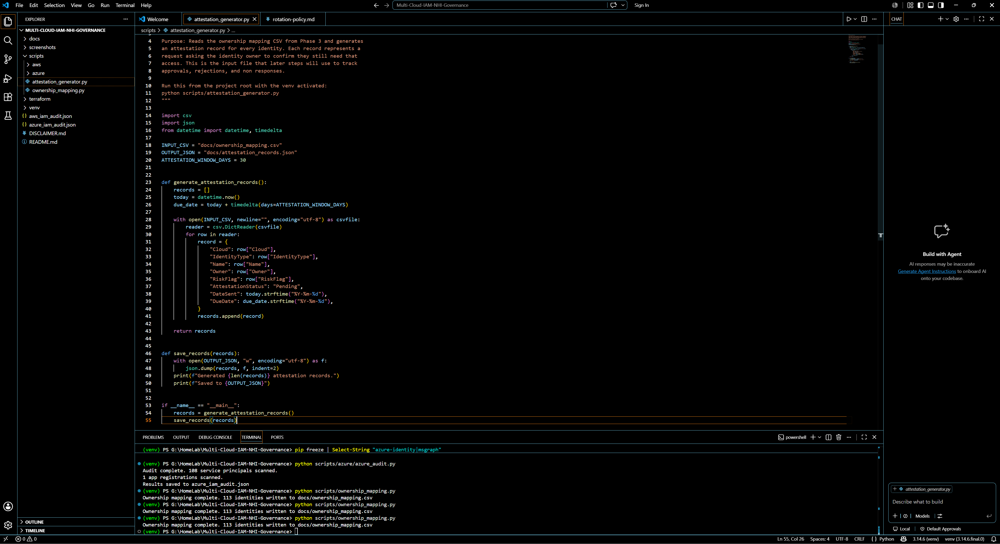

`scripts/attestation_generator.py` was built to automate what would
otherwise be manual spreadsheet work, generating an attestation record
for every identity in `ownership_mapping.csv`, each starting in a
Pending state with a 30 day response window.

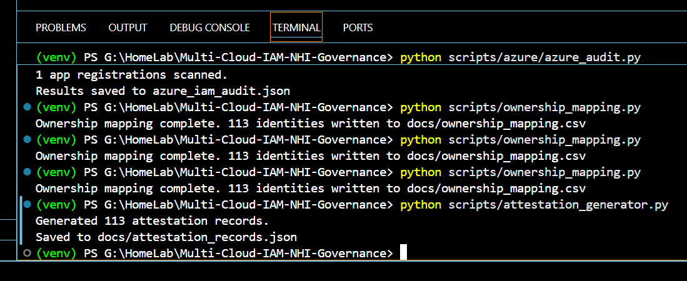

The script ran successfully, generating 113 attestation records and
saving them to `docs/attestation_records.json`.

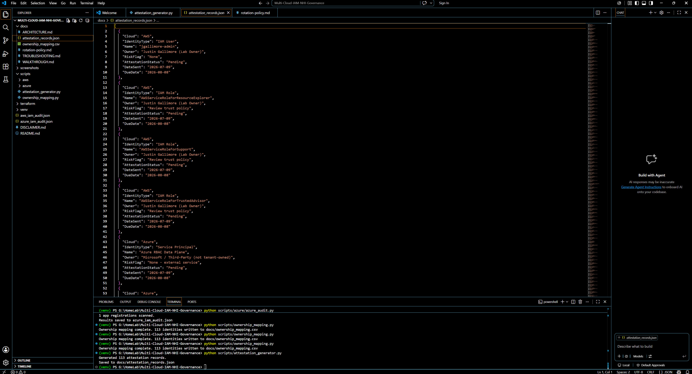

The output file was reviewed, confirming each identity carried its
Cloud, IdentityType, Name, Owner, and RiskFlag fields from Phase 3,
along with the new AttestationStatus, DateSent, and DueDate fields.

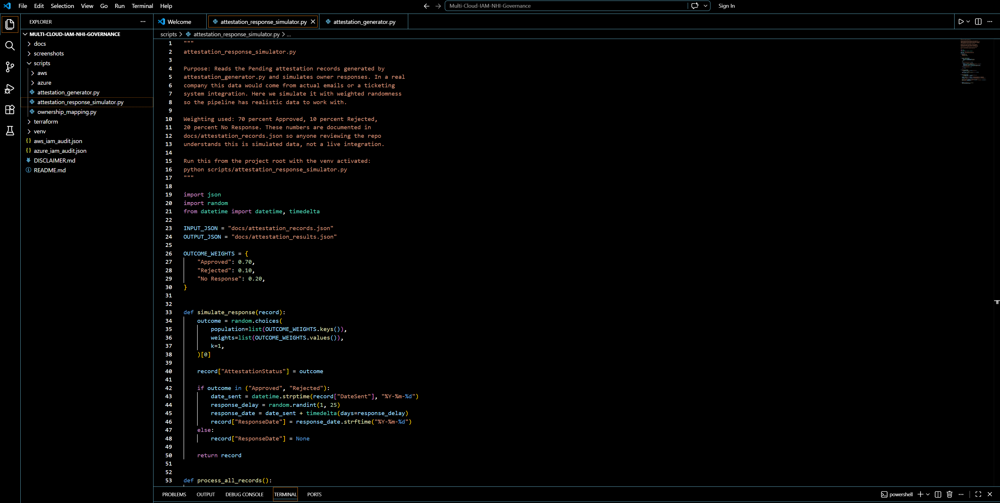

`scripts/attestation_response_simulator.py` was built as a separate
script rather than folded into the generator, following a single
responsibility principle so each script in the pipeline owns exactly
one job. It simulates realistic owner responses using a weighted
random outcome, 70 percent Approved, 10 percent Rejected, and 20
percent No Response, since there were no real coworkers available to
respond to attestation requests in this lab.

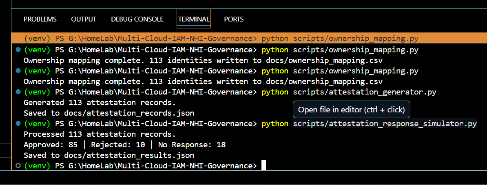

The simulator processed all 113 records, returning a breakdown of 85
Approved, 10 Rejected, and 18 No Response, numbers that closely mirror
realistic enterprise attestation outcomes.

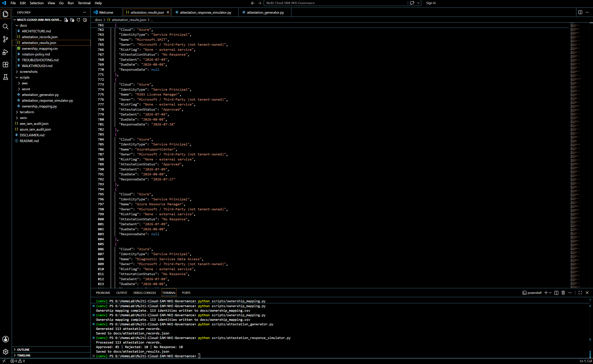

The results file was reviewed to confirm the mix of statuses, with
Approved and Rejected records carrying a real response date and No
Response records carrying a null response date.

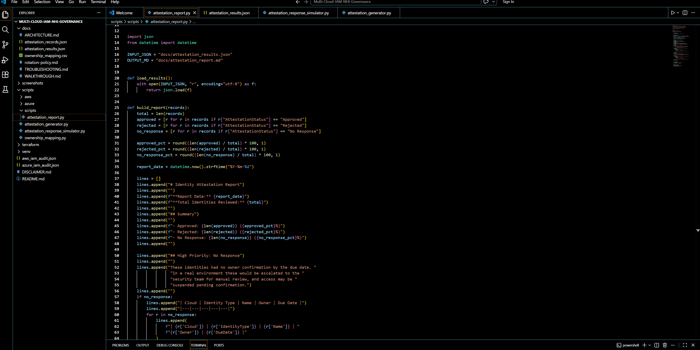

`scripts/attestation_report.py` was built as the third and final
script in the pipeline, turning the raw JSON results into a polished
markdown governance report, complete with summary statistics and
individually named tables for every No Response and Rejected identity.

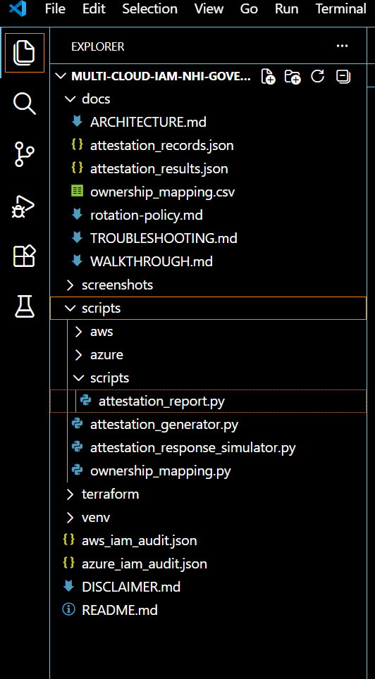

The first attempt to run the report script failed with a "No such file
or directory" error. The breadcrumb path at the top of the VS Code
editor revealed the cause: the file had been created one directory
level too deep, at `scripts/scripts/attestation_report.py` instead of
`scripts/attestation_report.py`, since the file explorer was already
expanded into the scripts folder at the moment the file was created.

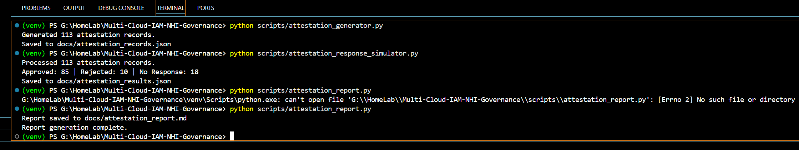

The file was moved up one level to the correct location, the now empty
nested folder was deleted, and the script ran successfully, saving the
completed report to `docs/attestation_report.md`.

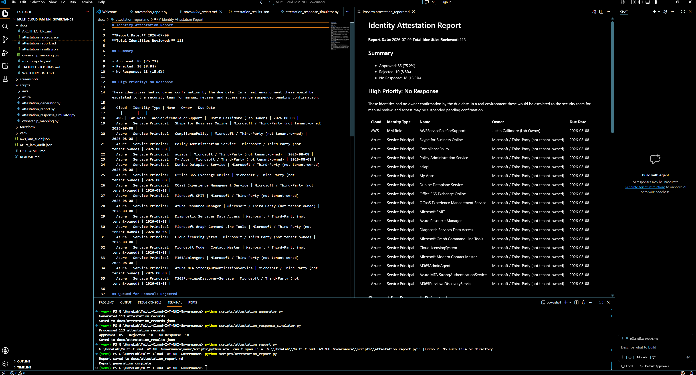

The rendered markdown preview confirmed the report reads like a real
governance deliverable, with a title, bold summary statistics, and
clean tables listing every high-risk identity by name, owner, and due
date.

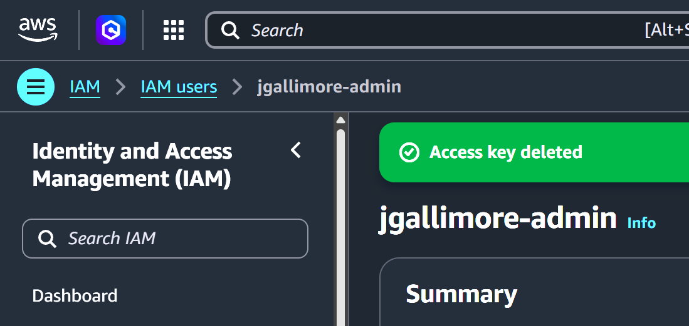

While preparing to push this project's initial commit, an AWS Secret
Access Key was unexpectedly printed in plain text in the terminal
during `aws configure`, rather than being masked as expected. The
exposed key, along with the original key it was meant to replace, was
immediately deactivated and deleted, and a third key was generated and
configured without capturing the configuration step in any screenshot.
This incident reinforced a standing rule for this project: never
screenshot the `aws configure` prompt itself, only verification
commands like `aws sts get-caller-identity`, which confirm credentials
work without ever displaying a secret.

---

## Phase 6: OIDC Federation with Terraform and GitHub Actions

This phase replaces static AWS access keys in CI/CD with OIDC
federation. Instead of storing an AWS access key and secret key inside
GitHub, GitHub Actions requests a short lived identity token at
runtime, AWS validates that token against a scoped trust policy, and
hands back temporary credentials that expire automatically once the
workflow finishes. No long lived secrets are ever stored in GitHub.

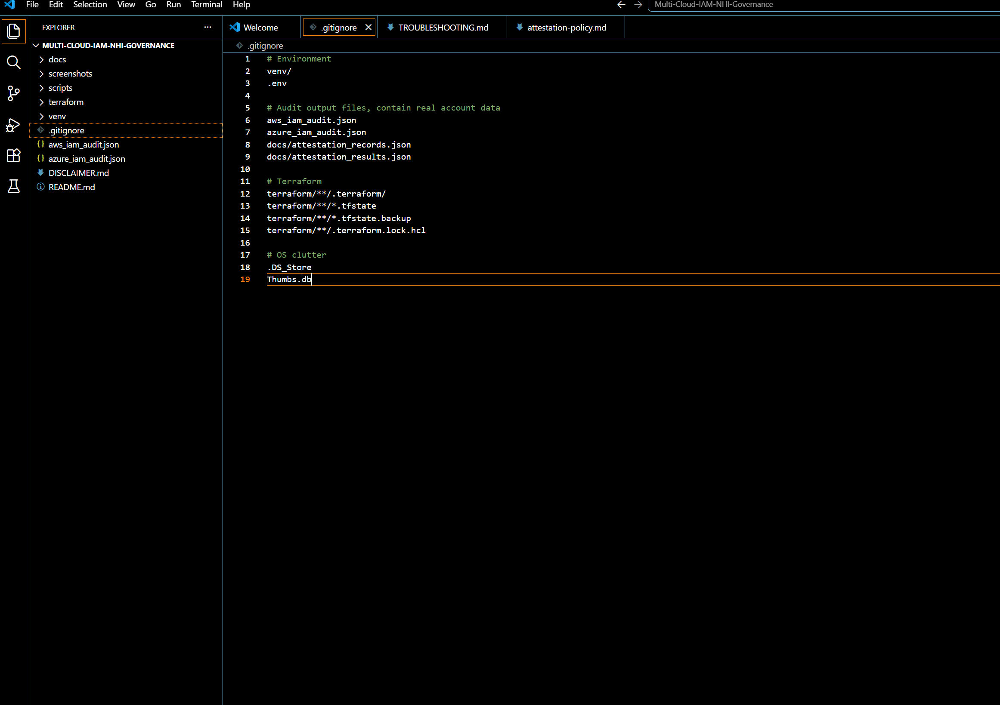

Before any Terraform work began, the GitHub repository was created and
a `.gitignore` was put in place to keep real audit output, Terraform
state files, and other sensitive local artifacts out of the public
repo.

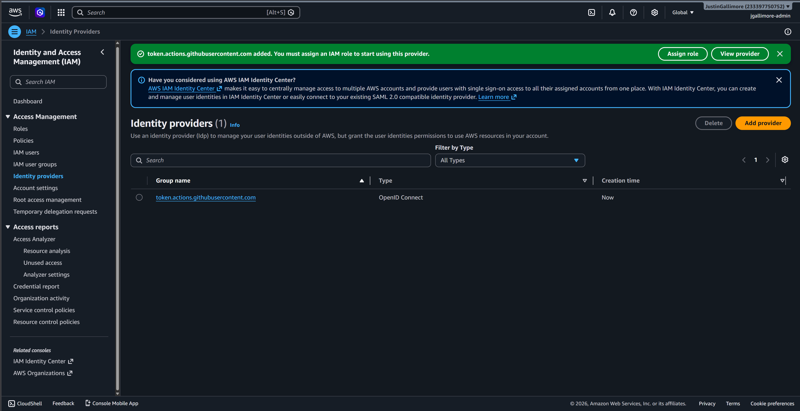

An OpenID Connect identity provider was registered in AWS IAM pointing
to `token.actions.githubusercontent.com`, with the audience set to
`sts.amazonaws.com`. This step alone does not grant any access, it
only tells AWS that tokens issued by GitHub are worth evaluating.

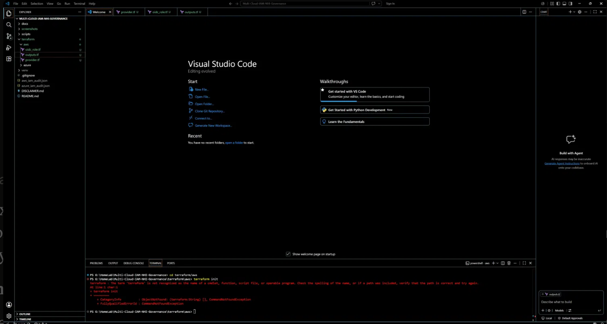

The first attempt to run Terraform failed since it had not yet been
installed on this machine, the same class of PATH issue encountered
earlier in this project with AWS CLI and Python.

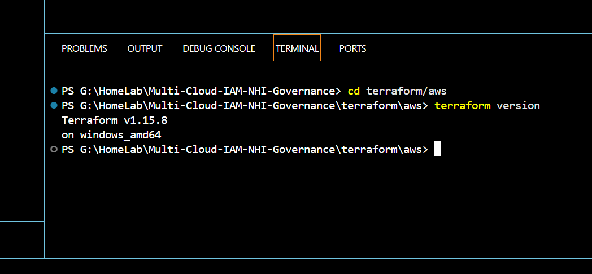

After downloading the Terraform binary, placing it in a dedicated
folder, and adding that folder to the system PATH, `terraform version`
confirmed a successful install.

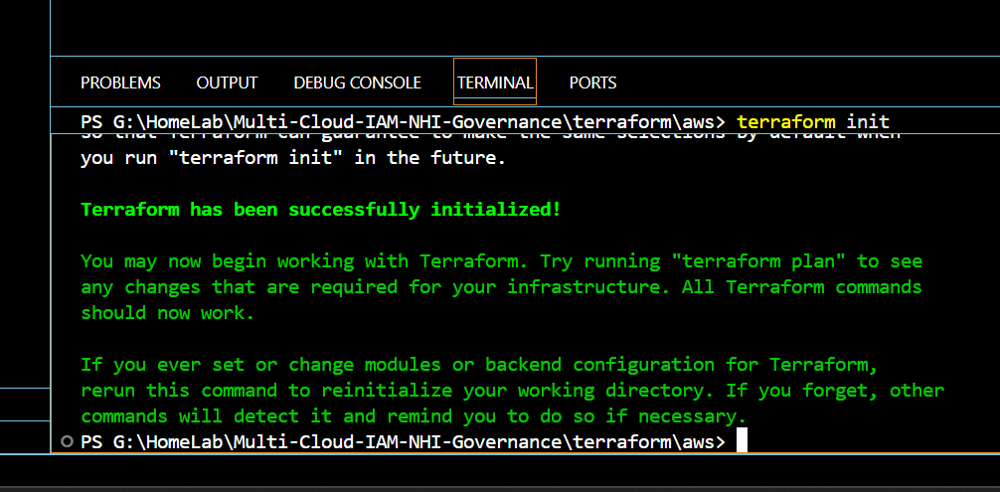

`terraform init` downloaded the AWS provider plugin and set up the
local working directory.

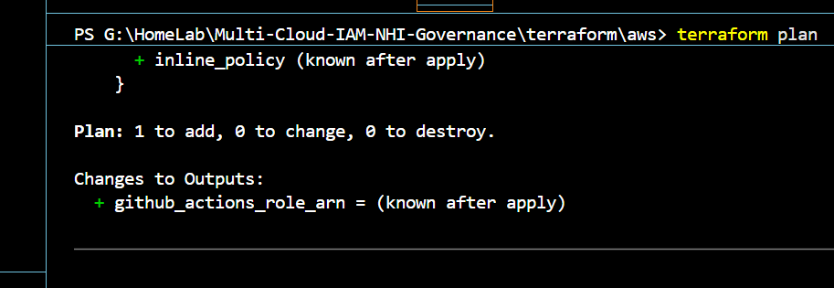

`terraform plan` showed the exact IAM role and trust policy about to
be created, scoped specifically to this repository and the `main`
branch, so no other GitHub repository could ever assume this role even
with a valid GitHub OIDC token.

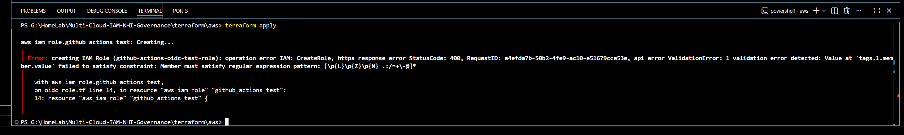

The first `terraform apply` failed with an AWS validation error. The
tag value included a comma, which falls outside AWS's allowed
character set for tag values. The comma was removed from the tag
string.

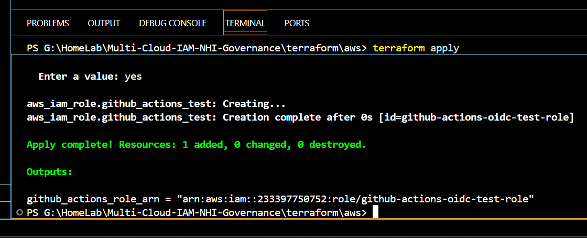

After the fix, `terraform apply` completed successfully and returned
the new IAM role's ARN, confirming the role was live in AWS.

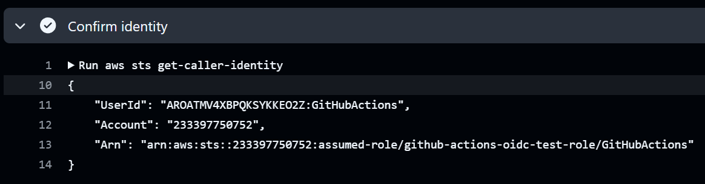

A GitHub Actions workflow was built to request an OIDC token, assume
the new IAM role, and call `aws sts get-caller-identity` to confirm the
assumed identity. The manually triggered run completed successfully in
12 seconds, returning the assumed role ARN and confirming the full
chain worked end to end, GitHub token to AWS trust policy to temporary
credentials, with no static keys stored anywhere in the process.

---

## Project Status

Phases 1 through 6 are complete. Remaining work is final documentation
polish, sample files for public reference, and packaging for Phase 7.